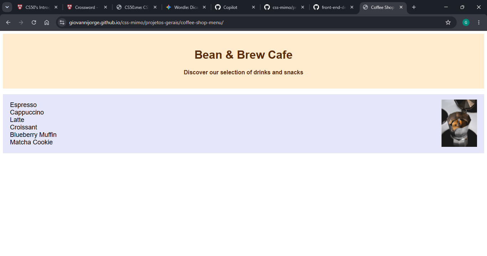

# Coffee Shop Menu

Demo online: [https://giovannijorge.github.io/css-mimo/projetos-gerais/coffee-shop-menu/](https://giovannijorge.github.io/css-mimo/projetos-gerais/coffee-shop-menu/)

Descrição
--------
Este é um projeto simples de menu de cafeteria desenvolvido em HTML e CSS. A aplicação apresenta uma página estática com bebidas e sobremesas, exibindo nomes e preços de forma organizada e agradável. Foi criada como exercício educacional durante o curso de CSS da Mimo, com foco em estruturação de conteúdo e estilização visual.

Funcionalidades
--------------
- Exibição de menu com categorias (cafés e sobremesas).
- Listagem de itens com nome e preço.
- Layout centralizado e visual limpo.
- Estilo inspirado em cardápios de cafeteria.
- Estrutura simples para estudo de HTML semântico e CSS.

Como usar
--------
1. Abra o arquivo `index.html` localmente no navegador ou acesse a demo online:
   - [https://giovannijorge.github.io/css-mimo/projetos-gerais/coffee-shop-menu/](https://giovannijorge.github.io/css-mimo/projetos-gerais/coffee-shop-menu/)
2. Visualize as categorias e os itens disponíveis no cardápio.
3. Use o projeto como base para praticar personalizações de layout, cores e tipografia.

Como funciona
---------------------
A página utiliza uma estrutura HTML com seções para cada categoria do menu e elementos de texto para exibir itens e valores.  
O CSS é responsável por:
- Definir cores, espaçamentos e tipografia.
- Organizar visualmente os elementos do cardápio.
- Melhorar a leitura e a apresentação geral da interface.

Regras aplicadas:
- Estrutura semântica para facilitar manutenção.
- Separação de responsabilidades entre conteúdo (HTML) e estilo (CSS).
- Organização visual com foco em legibilidade.

Exemplos
--------
Categoria: `Coffee`  
Item: `French Vanilla` — `$3.00`

Categoria: `Desserts`  
Item: `Donut` — `$1.50`

Arquivos principais
-------------------
- `index.html` — estrutura e conteúdo do menu.
- `style.css` — estilos, cores e layout da página.
- `preview.png` — imagem de preview usada neste README.

Tecnologias
-----------
- HTML5
- CSS3

Acessibilidade e boas práticas
------------------------------
- Uso de tags semânticas para melhor estrutura do conteúdo.
- Hierarquia visual clara para facilitar leitura.
- Código simples e organizado para fins de estudo e evolução do projeto.

Contribuição
------------
Contribuições são bem-vindas. Sugestões:
- Adicionar novas categorias e itens ao cardápio.
- Melhorar responsividade para telas menores.
- Incluir modo escuro (dark mode).
- Aplicar animações sutis na interface.

Para contribuir:
1. Fork este repositório.
2. Crie uma branch com sua feature: `git checkout -b minha-feature`.
3. Faça commits descritivos.
4. Abra um Pull Request descrevendo as mudanças.

Licença
-------
Nenhuma licença específica foi adicionada a este repositório por enquanto. Se desejar, adicione um arquivo `LICENSE` (por exemplo MIT) para permitir reuso explícito.

Autor
-----
Giovanni Jorge — repositório principal: [GiovanniJorge/css-mimo](https://github.com/GiovanniJorge/css-mimo)

Contato
-------
Problemas, dúvidas ou sugestões podem ser abertas como issues no repositório ou enviadas via perfil do GitHub.
