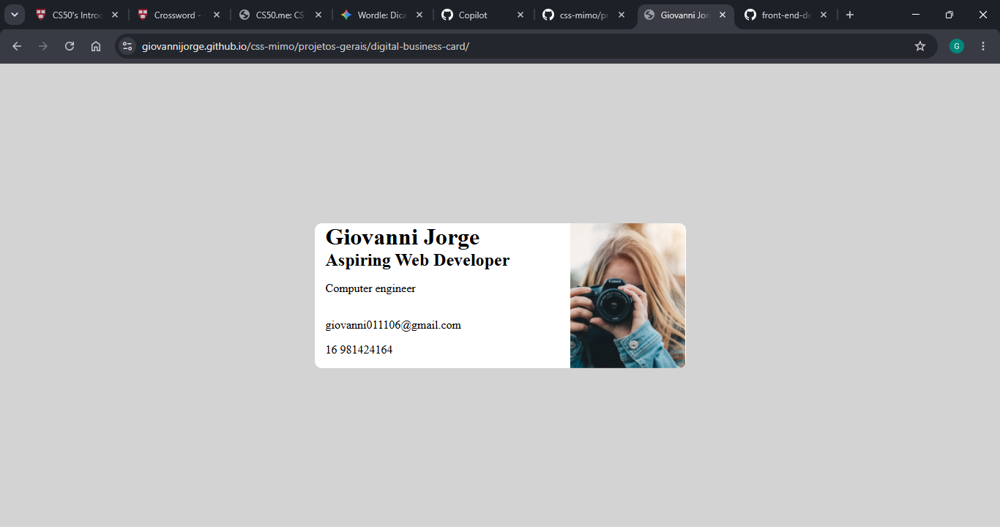

# Digital Business Card

Demo online: [https://giovannijorge.github.io/css-mimo/projetos-gerais/digital-business-card/](https://giovannijorge.github.io/css-mimo/projetos-gerais/digital-business-card/)

Descrição
--------
Este é um projeto simples de **cartão de visita digital** desenvolvido com HTML, CSS e JavaScript. A aplicação apresenta informações profissionais de forma visualmente agradável, servindo como exercício prático de estruturação de layout, estilização e interatividade básica.

Funcionalidades
--------------
- Exibição de informações pessoais/profissionais em formato de cartão.
- Layout moderno e responsivo.
- Botões com links para contato e redes sociais.
- Estrutura limpa para fácil personalização de conteúdo.
- Interface leve para apresentação rápida de perfil.

Como usar
--------
1. Abra o arquivo `index.html` localmente no navegador ou acesse a demo online:
   - [https://giovannijorge.github.io/css-mimo/projetos-gerais/digital-business-card/](https://giovannijorge.github.io/css-mimo/projetos-gerais/digital-business-card/)
2. Visualize os dados do cartão (nome, descrição, links etc.).
3. Clique nos botões para acessar os canais de contato/redes.
4. Para personalizar, edite os arquivos do projeto com suas próprias informações.

Como funciona
---------------------
O projeto organiza os elementos principais de um cartão digital em uma estrutura HTML semântica, aplica estilos com CSS para criar identidade visual e utiliza JavaScript para possíveis interações (como ações de botões e links dinâmicos).

Regras aplicadas:
- Estrutura em componentes visuais simples e reutilizáveis.
- Separação entre conteúdo (`index.html`), estilo (`style.css`) e comportamento (`script.js`).
- Adaptação para diferentes tamanhos de tela (responsividade).

Exemplos
--------
Exemplo de uso:
- Exibir nome, cargo e mini biografia.
- Incluir botões como `Email`, `LinkedIn`, `GitHub` ou `Portfólio`.
- Usar foto/avatar para identificação visual.

Arquivos principais
-------------------
- `index.html` — interface do cartão digital.
- `style.css` — estilos, cores, tipografia e layout.
- `script.js` — interações da página (se aplicável).
- `preview.png` — imagem de preview usada neste README.

Tecnologias
-----------
- HTML5
- CSS3
- JavaScript (vanilla)

Acessibilidade e boas práticas
------------------------------
- Uso de marcação semântica para melhor leitura por tecnologias assistivas.
- Botões e links com textos claros para navegação objetiva.
- Contraste de cores com foco em legibilidade.
- Código organizado para facilitar manutenção e aprendizado.

Contribuição
------------
Contribuições são bem-vindas. Sugestões:
- Melhorar animações e microinterações.
- Adicionar modo escuro (dark mode).
- Incluir novas seções no cartão (skills, projetos, contatos extras).
- Refinar acessibilidade (aria-labels, foco visível, navegação por teclado).

Para contribuir:
1. Fork este repositório.
2. Crie uma branch com sua feature: `git checkout -b minha-feature`.
3. Faça commits descritivos.
4. Abra um Pull Request descrevendo as mudanças.

Licença
-------
Nenhuma licença específica foi adicionada a este repositório por enquanto. Se desejar, adicione um arquivo `LICENSE` (por exemplo MIT) para permitir reuso explícito.

Autor
-----
Giovanni Jorge — repositório principal: [GiovanniJorge/css-mimo](https://github.com/GiovanniJorge/css-mimo)

Contato
-------
Problemas, dúvidas ou sugestões podem ser abertas como issues no repositório ou enviadas via perfil do GitHub.
