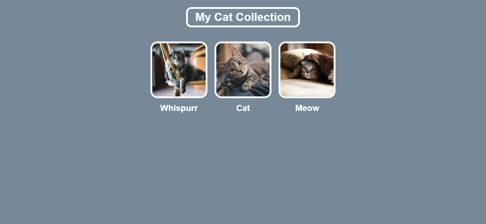

# Gallery

Demo online: [https://giovannijorge.github.io/css-mimo/projetos-gerais/gallery/](https://giovannijorge.github.io/css-mimo/projetos-gerais/gallery/)

Descrição
--------
Este é um projeto simples de **galeria de imagens** desenvolvido com HTML, CSS e JavaScript. A aplicação foi criada como exercício prático do curso de CSS da Mimo, com foco em estrutura visual, organização de elementos e interação básica no navegador.

Funcionalidades
--------------
- Exibição de imagens em formato de galeria.
- Layout visual organizado e responsivo.
- Estilo moderno com foco em legibilidade e apresentação.
- Interações simples para navegação/visualização (quando aplicável no projeto).
- Estrutura fácil de expandir com novas imagens e categorias.

Como usar
--------
1. Abra o arquivo `index.html` localmente no navegador ou acesse a demo online:
   - [https://giovannijorge.github.io/css-mimo/projetos-gerais/gallery/](https://giovannijorge.github.io/css-mimo/projetos-gerais/gallery/)
2. Navegue pelas imagens exibidas na galeria.
3. (Opcional) Edite os arquivos para adicionar novas imagens, títulos ou estilos.

Como funciona
---------------------
A galeria organiza elementos visuais em uma grade (grid/flex), aplicando estilos para espaçamento, alinhamento e responsividade.  
Quando houver JavaScript, ele é responsável por comportamentos interativos, como destaque de imagem, navegação ou efeitos de transição.

Regras aplicadas:
- Estrutura semântica em HTML para melhor organização.
- Estilização com CSS para layout e responsividade.
- Scripts em JavaScript para interações e manipulação do DOM.
- Separação entre estrutura (`index.html`), estilo (`style.css`) e comportamento (`script.js`).

Exemplos
--------
Exemplo de uso:
- Visualizar uma coleção de imagens em um layout de galeria.
- Adaptar a visualização para diferentes tamanhos de tela.

Arquivos principais
-------------------
- `index.html` — estrutura da interface da galeria.
- `style.css` — estilos visuais, layout e responsividade.
- `script.js` — interações da galeria e manipulação do DOM.
- `preview.png` — imagem de preview usada neste README.

Tecnologias
-----------
- HTML5
- CSS3
- JavaScript (vanilla)

Acessibilidade e boas práticas
------------------------------
- Uso de texto alternativo (`alt`) em imagens para acessibilidade.
- Contraste de cores com atenção à legibilidade.
- Estrutura clara de classes e componentes para manutenção.
- Código organizado para facilitar estudo e evolução do projeto.

Contribuição
------------
Contribuições são bem-vindas. Sugestões:
- Adicionar filtros por categoria.
- Implementar lightbox para visualização ampliada.
- Melhorar animações e transições entre imagens.
- Otimizar carregamento e desempenho com imagens maiores.

Para contribuir:
1. Fork este repositório.
2. Crie uma branch com sua feature: `git checkout -b minha-feature`.
3. Faça commits descritivos.
4. Abra um Pull Request descrevendo as mudanças.

Licença
-------
Nenhuma licença específica foi adicionada a este repositório por enquanto. Se desejar, adicione um arquivo `LICENSE` (por exemplo MIT) para permitir reuso explícito.

Autor
-----
Giovanni Jorge — repositório principal: [GiovanniJorge/css-mimo](https://github.com/GiovanniJorge/css-mimo)

Contato
-------
Problemas, dúvidas ou sugestões podem ser abertas como issues no repositório ou enviadas via perfil do GitHub.
