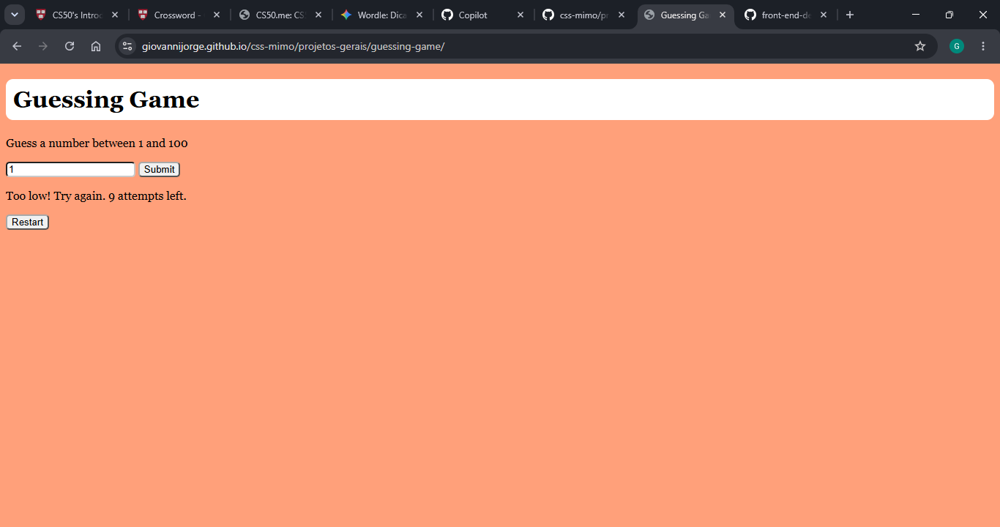

# Guessing Game

Demo online: [https://giovannijorge.github.io/css-mimo/projetos-gerais/guessing-game/](https://giovannijorge.github.io/css-mimo/projetos-gerais/guessing-game/)

Descrição
--------
Este é um projeto simples de jogo de adivinhação implementado em HTML, CSS e JavaScript. A aplicação gera um número aleatório e permite que o jogador tente adivinhar, recebendo feedback a cada tentativa. Foi criada como exercício educacional e como exemplo prático de lógica condicional, manipulação de eventos e atualização dinâmica do DOM.

Funcionalidades
--------------
- Gera um número aleatório para o jogador adivinhar.
- Recebe palpites do usuário por campo de entrada.
- Informa se o palpite é maior, menor ou igual ao número secreto.
- Mostra quantidade de tentativas realizadas.
- Permite reiniciar o jogo para jogar novamente.
- Interface simples e responsiva para prática rápida.

Como usar
--------
1. Abra o arquivo `index.html` localmente no navegador ou acesse a demo online:
   - [https://giovannijorge.github.io/css-mimo/projetos-gerais/guessing-game/](https://giovannijorge.github.io/css-mimo/projetos-gerais/guessing-game/)
2. Digite um número no campo de palpite.
3. Clique no botão para enviar o palpite.
4. Leia o feedback exibido na tela.
5. Continue até acertar o número secreto.
6. Use a opção de reinício para começar uma nova rodada.

Como funciona
---------------------
O jogo escolhe um número secreto aleatório dentro de um intervalo definido. A cada palpite:
- Se o número digitado for menor que o secreto, o jogo informa que o valor é baixo.
- Se for maior, informa que o valor é alto.
- Se for igual, informa acerto e finaliza a rodada.

Regras aplicadas:
- Apenas números válidos dentro do intervalo permitido são considerados.
- Cada tentativa é contabilizada.
- O jogo pode ser reiniciado para gerar um novo número secreto.

Exemplos
--------
Número secreto: `42`  
Palpite: `30`  
Resultado: `Muito baixo! Tente novamente.`

Número secreto: `42`  
Palpite: `57`  
Resultado: `Muito alto! Tente novamente.`

Número secreto: `42`  
Palpite: `42`  
Resultado: `Parabéns! Você acertou.`

Arquivos principais
-------------------
- `index.html` — estrutura da interface do jogo.
- `style.css` — estilos e layout.
- `script.js` — lógica principal (geração do número, validação, comparação e feedback).
- `preview.png` — imagem de preview usada neste README.

Tecnologias
-----------
- HTML5
- CSS3
- JavaScript (vanilla)

Acessibilidade e boas práticas
------------------------------
- Campos com labels para melhor compatibilidade com leitores de tela.
- Mensagens de feedback claras para orientar o usuário.
- Estrutura simples e sem dependências externas para facilitar estudo e manutenção.

Contribuição
------------
Contribuições são bem-vindas. Sugestões:
- Adicionar níveis de dificuldade (intervalos diferentes).
- Criar sistema de pontuação baseado no número de tentativas.
- Incluir histórico de partidas.
- Melhorar feedback visual com animações e estados.

Para contribuir:
1. Fork este repositório.
2. Crie uma branch com sua feature: `git checkout -b minha-feature`.
3. Faça commits descritivos.
4. Abra um Pull Request descrevendo as mudanças.

Licença
-------
Nenhuma licença específica foi adicionada a este repositório por enquanto. Se desejar, adicione um arquivo `LICENSE` (por exemplo MIT) para permitir reuso explícito.

Autor
-----
Giovanni Jorge — repositório principal: [GiovanniJorge/css-mimo](https://github.com/GiovanniJorge/css-mimo)

Contato
-------
Problemas, dúvidas ou sugestões podem ser abertas como issues no repositório ou enviadas via perfil do GitHub.
