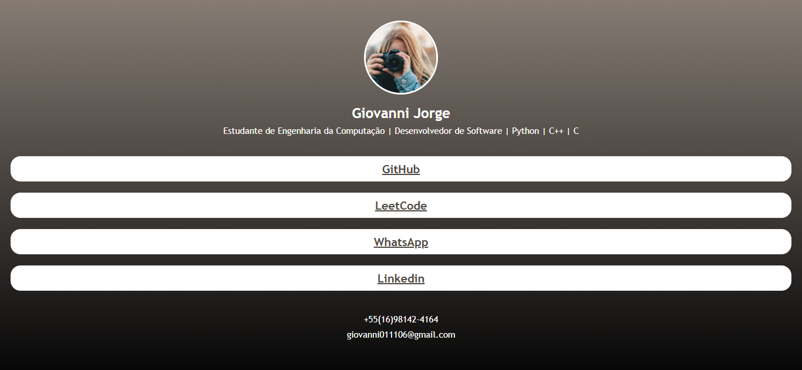

# Linktree

Demo online: [https://giovannijorge.github.io/css-mimo/projetos-gerais/linktree/](https://giovannijorge.github.io/css-mimo/projetos-gerais/linktree/)

Descrição
--------
Este é um projeto simples de página estilo **Linktree**, desenvolvido em HTML e CSS (com possível apoio de JavaScript), para centralizar e exibir links importantes em uma interface visual limpa e responsiva.  
Foi criado como exercício prático do curso de CSS da Mimo, com foco em layout, estilização e organização de conteúdo.

Funcionalidades
--------------
- Exibe uma lista de links principais em um único lugar.
- Layout responsivo para desktop e dispositivos móveis.
- Estrutura visual simples, moderna e de fácil leitura.
- Possibilidade de personalização de cores, tipografia e botões.
- Navegação rápida para redes sociais, portfólio e outros conteúdos.

Como usar
--------
1. Abra o arquivo `index.html` localmente no navegador ou acesse a demo online:
   - [https://giovannijorge.github.io/css-mimo/projetos-gerais/linktree/](https://giovannijorge.github.io/css-mimo/projetos-gerais/linktree/)
2. Visualize os botões/links disponíveis na página.
3. Clique no link desejado para navegar até o destino.
4. (Opcional) Edite os links no HTML para usar seus próprios destinos.

Como funciona
---------------------
A página organiza links em formato de botões dentro de um container centralizado, com estilização feita em CSS para melhorar a apresentação e a experiência de uso.

Estrutura geral:
- Um bloco principal com avatar/título (quando aplicável).
- Uma lista de links clicáveis.
- Estilos para hover/foco, melhorando interação e acessibilidade.

Regras aplicadas:
- Estrutura semântica com HTML.
- Estilização modular com CSS.
- Adaptação de layout para diferentes tamanhos de tela.

Exemplos
--------
Entrada: Clique em **"Meu GitHub"**  
Saída: Abre o perfil do GitHub em uma nova aba (quando configurado com `target="_blank"`).

Entrada: Clique em **"Portfólio"**  
Saída: Redireciona para a página de portfólio configurada no link.

Arquivos principais
-------------------
- `index.html` — estrutura da página e links.
- `style.css` — estilos visuais e responsividade.
- `script.js` — interações extras (se aplicável).
- `preview.png` — imagem de preview usada neste README.

Tecnologias
-----------
- HTML5
- CSS3
- JavaScript (vanilla, se utilizado)

Acessibilidade e boas práticas
------------------------------
- Uso de textos claros nos links para melhor compreensão.
- Estrutura organizada para facilitar navegação por teclado.
- Contraste de cores pensado para legibilidade.
- Código simples para facilitar manutenção e aprendizado.

Contribuição
------------
Contribuições são bem-vindas. Sugestões:
- Adicionar animações suaves nos botões.
- Incluir modo claro/escuro.
- Melhorar acessibilidade com atributos ARIA quando necessário.
- Expandir para suportar categorias de links.

Para contribuir:
1. Fork este repositório.
2. Crie uma branch com sua feature: `git checkout -b minha-feature`.
3. Faça commits descritivos.
4. Abra um Pull Request descrevendo as mudanças.

Licença
-------
Nenhuma licença específica foi adicionada a este repositório por enquanto.  
Se desejar, adicione um arquivo `LICENSE` (por exemplo MIT) para permitir reuso explícito.

Autor
-----
Giovanni Jorge — repositório principal: [GiovanniJorge/css-mimo](https://github.com/GiovanniJorge/css-mimo)

Contato
-------
Problemas, dúvidas ou sugestões podem ser abertas como issues no repositório ou enviadas via perfil do GitHub.
