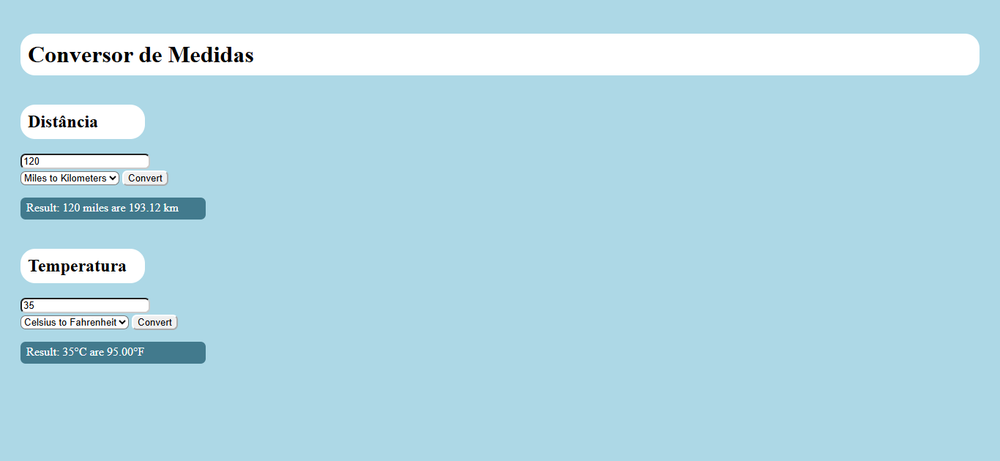

# Unit Converter

Demo online: [https://giovannijorge.github.io/css-mimo/projetos-gerais/unit-converter/](https://giovannijorge.github.io/css-mimo/projetos-gerais/unit-converter/)

Descrição
--------
Este é um projeto simples de conversão de unidades, implementado em HTML, CSS e JavaScript. A aplicação permite converter valores entre diferentes unidades de medida de forma rápida e prática. Foi criada como exercício educacional e como exemplo prático de manipulação de inputs, cálculos e atualização dinâmica da interface via DOM.

Funcionalidades
--------------
- Conversão de valores entre unidades de medida.
- Entrada numérica com atualização dinâmica do resultado.
- Interface simples e responsiva.
- Exibição clara do valor original e convertido.
- Estrutura objetiva para estudo de lógica e interação com DOM.

Como usar
--------
1. Abra o arquivo `index.html` localmente no navegador ou acesse a demo online:
   - [https://giovannijorge.github.io/css-mimo/projetos-gerais/unit-converter/](https://giovannijorge.github.io/css-mimo/projetos-gerais/unit-converter/)
2. Insira o valor que deseja converter.
3. Selecione as unidades de origem e destino (quando aplicável).
4. Veja o resultado exibido automaticamente na interface.
5. Altere o valor para testar diferentes conversões.

Como funciona
---------------------
O conversor aplica fatores de conversão predefinidos para transformar um valor de uma unidade de origem para uma unidade de destino.  
Exemplo geral:

- Valor convertido = valor de entrada × fator de conversão

Regras aplicadas:
- Apenas valores numéricos válidos são processados.
- Entradas vazias ou inválidas podem resultar em mensagem de aviso/valor padrão.
- O resultado é atualizado dinamicamente conforme o usuário interage com os campos.

Exemplos
--------
Entrada: `10` (unidade A → unidade B)  
Saída: `resultado convertido correspondente`

Entrada: `100` (unidade X → unidade Y)  
Saída: `resultado convertido correspondente`

Arquivos principais
-------------------
- `index.html` — interface do usuário.
- `style.css` — estilos e layout.
- `script.js` — lógica de conversão e manipulação do DOM.
- `preview.png` — imagem de preview usada neste README.

Tecnologias
-----------
- HTML5
- CSS3
- JavaScript (vanilla)

Acessibilidade e boas práticas
------------------------------
- Estrutura semântica para facilitar navegação e manutenção.
- Labels e organização visual para melhor usabilidade.
- Contraste de cores pensado para legibilidade.
- Uso mínimo de bibliotecas externas para facilitar estudo e entendimento do código.

Contribuição
------------
Contribuições são bem-vindas. Sugestões:
- Adicionar novas categorias de conversão (temperatura, massa, distância etc.).
- Melhorar validação de entrada e mensagens de erro.
- Adicionar testes para garantir consistência dos resultados.
- Melhorar a experiência mobile e acessibilidade.

Para contribuir:
1. Fork este repositório.
2. Crie uma branch com sua feature: `git checkout -b minha-feature`.
3. Faça commits descritivos.
4. Abra um Pull Request descrevendo as mudanças.

Licença
-------
Nenhuma licença específica foi adicionada a este repositório por enquanto. Se desejar, adicione um arquivo `LICENSE` (por exemplo MIT) para permitir reuso explícito.

Autor
-----
Giovanni Jorge — repositório principal: [GiovanniJorge/css-mimo](https://github.com/GiovanniJorge/css-mimo)

Contato
-------
Problemas, dúvidas ou sugestões podem ser abertas como issues no repositório ou enviadas via perfil do GitHub.
